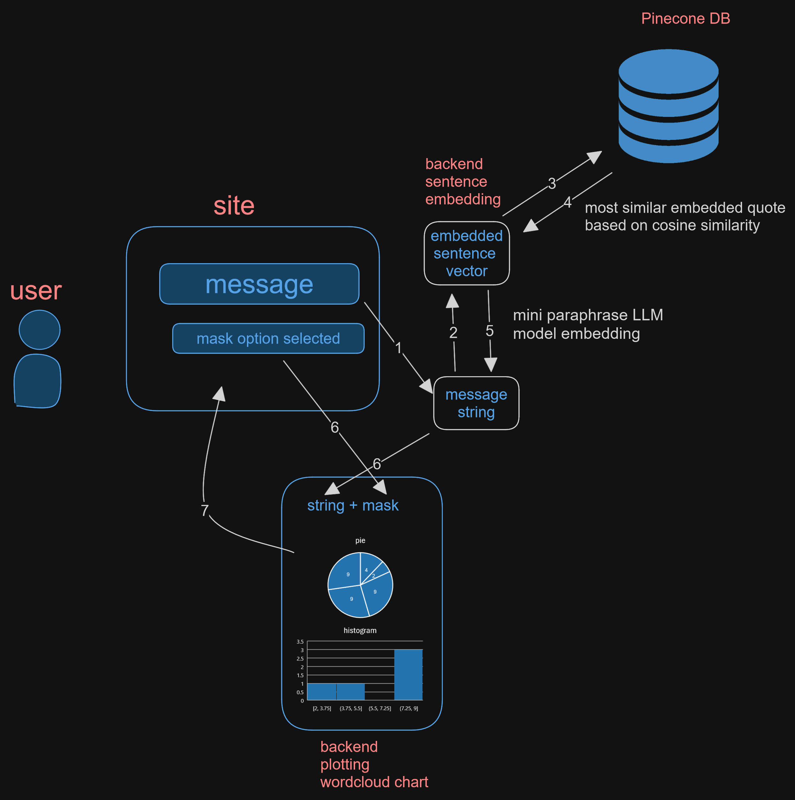
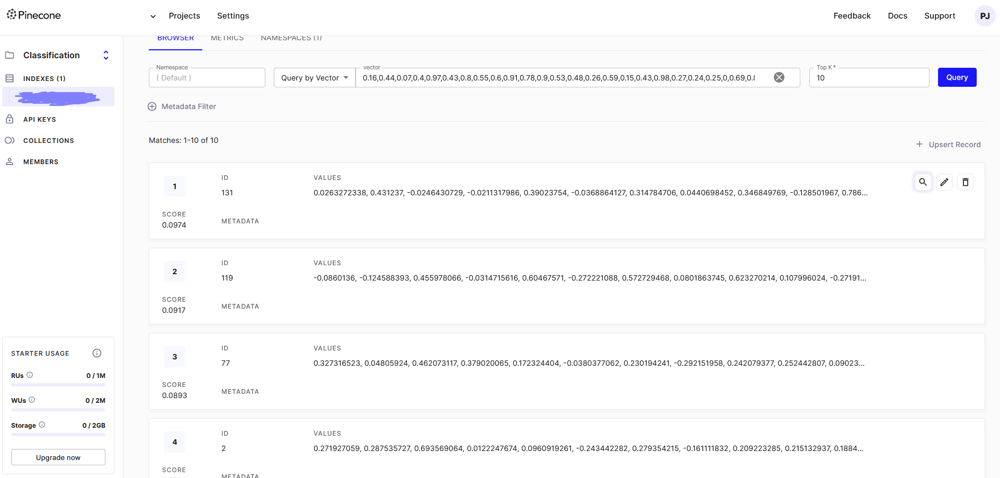
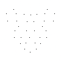
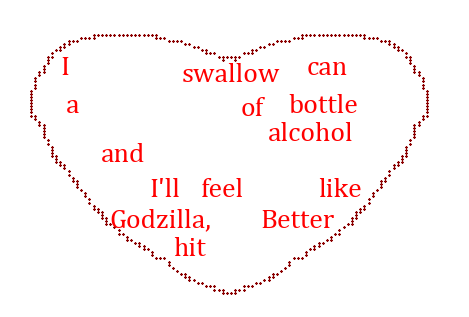
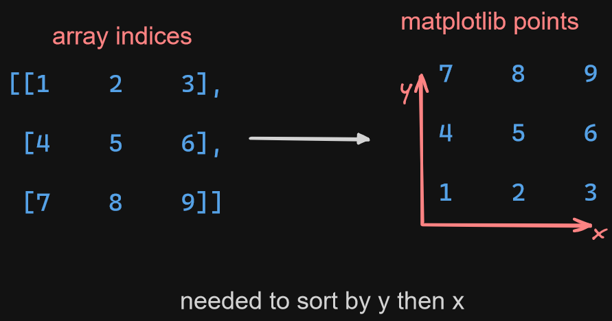
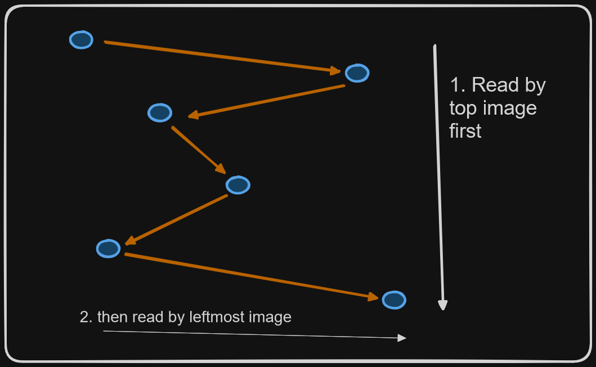
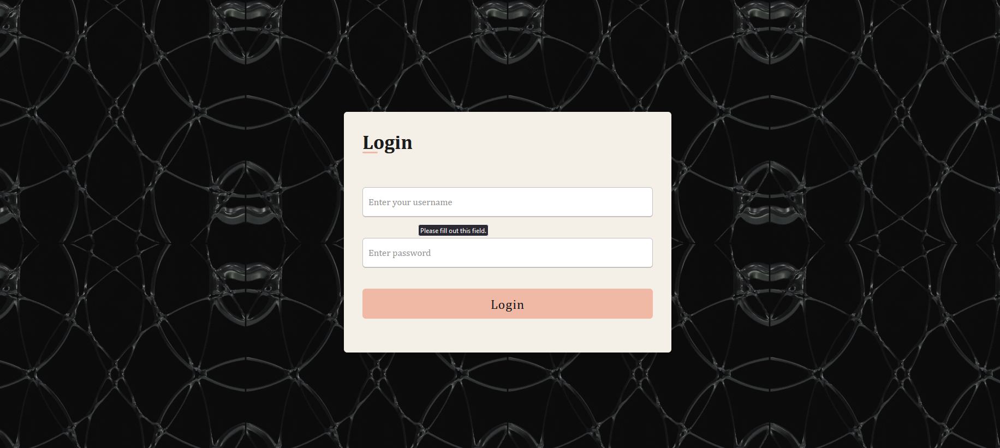
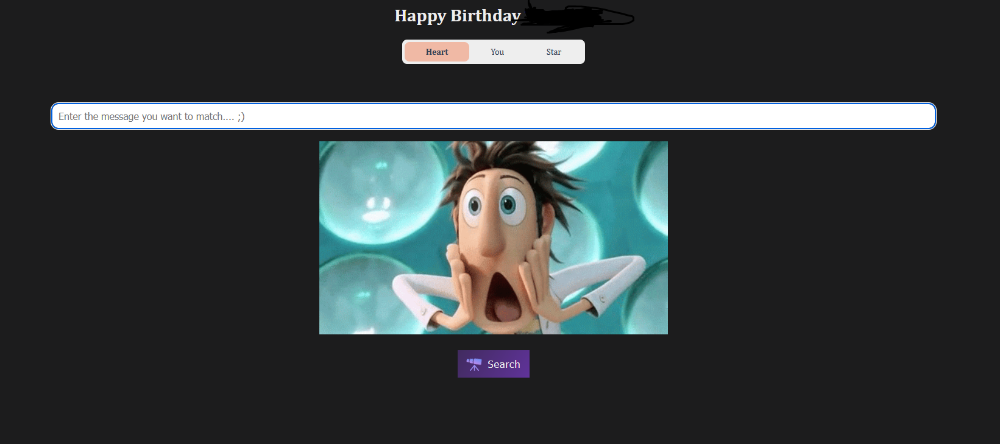

# Inspiration

The main inspiration for this project was to integrate the different applied data science and web development technologies I had learnt to make a creative gift for someone special to me. <3
>Hint for login: nickname

The site looks as following:

  

# What does the project do?
The project takes a message from the user, finds the closest resembling quote based on that message and presents it in a word cloud format as shown in the following diagram:

  

 

## Unexpected Error

The original plan was to use a sentence embedder to encode and decode, however, most decoder libraries are either predicting using the lines or not embedding it properly. So, I changed the quotes to be stored in the ID's of the vectors and then use the ID of the closest matching vector as the quote.

# Skills learnt

This project includes the following skills I have learnt (these are in the same order as I used them):

## Collecting and embedding data
1. Using `BeautifulSoup` and `request` to scrap the web for publicly available quotes and text

  

- I would create header with some placeholder metadata with browser and device information and then send requests to collect the quotes in various different html tags.

2. Using `Regex` to perform data extraction from the scraped data and performing simple data cleaning tasks
3. Using `sentence-transformer` and the $\text{paraphrase-MiniLM-L6-v2}$ LLM model to encode each sentences into a $\text{vector} \in \mathbb{R}^{384}$

## Uploading data to vector database
1. Connect to the **Pinecone** server with a free tier serverless database: *GCP (Google cloud Platform)*
2. Create an index without any metadata (making it easier to query data and maintain the index for this project specifically in future) with $\text{vector} \in \mathbb{R}^{384}$ and $\cos$ similarity
3. Upload all the embeddings to the database.
4. Using the database to quickly access the most similar vector given to the sentence

  

## Drawing human anatomy

The masks are created manually and for most of them, I had to learn how to draw different facial features such as: eyes, lips and how to make the proportions correct. I have always loved doodling but have always been bad at any anatomical drawing.
I will not be showing any images for it as I do not want to any accidental face reveal in the reference photos used.

## Creating custom wordcloud looking image
Initially I wanted to create a Wordcloud, with some image mask, with the quote retrieved from the database but there were 2 issues with it:
- WordCloud library does not account for repeated word
- WordCloud library does not care for the order while generating the image

As the library used matplotlib to create the image, I decided to create *walmart* version of such a software myself.

I split the sentence into an array of words where each word will be plotted on its own coordinate.

To create an image, I created 2 masked image such as the one shown below to create an outline to show the general shape of the wordcloud and other one being the mask to plot the words:

| Background shape mask | words plotting mask |
|---------------------- | ------------------- |
|  |  |
|  This is to create the outline for the word cloud | This is to plot each word of the sentence |

The final graph with some sentence will look as following:

  

The array indices needed to be changed to matplotlib $(x,y)$ coordinates as otherwise it would be plotted the other way around:

  

- This was done by simply reversing the `y` order of the `array[y][x]`. 

Then finally the words were plotted onto these points with being sorted with highest $y$ values and then the lowest $x$ values. 
- Rather than sorting the points twice, I sorted based on the following function: 
$$
\text{priority} = y^3 - x
$$
- This function would give higher precedence to $y$ values and if the values are similar, will pick the lower $x$ valued array
  - As all my masks image are on a $100 \times 100$ image (matrix) with each point being an integer $(x,y \in \mathbb{Z})$, $y^3$ > $x$ for any value above $1$.

This sorting order was chosen to create a comic book style reading pattern as shown in the following image:

  

## Creating Web site

The site was created using `Django` as a lot of custom `Python` classes were used for plotting the data points to create the chart or to communicate with the **Pinecone** database server

### User Authentication

First a simple user authentication page was created which uses the same Django admin data modelling to create a user with password management.
- The feature to create a user is not available in this project as this project is specifically made for a specific person, however, that feature along with proper backend and web development sites is further explored in the [Django sample site project](https://github.com/PUSH-YA/sample-site-python)

The login page is created with a repeating fractal background animation and then 

  

### Chart presentation

The site presents a form structure which takes the mask of the image and the text query as a POST request:

  

 - The gift present above is just a placeholder but will be replaced by a custom animation made in `manim` which a math animation library, further explored in [manim learning repo](https://github.com/PUSH-YA/manim_practice)

It uses the `CSRF` token to prevent *cross-site forgery* on the POST request. It also ensures that an authenticated user is logged in. Then, it performs the following steps:
1. It embeds the query using  
2. Finds the most similar embedding using the Pinecone database
3. De-embeds the retrieved vector into a string
4. Uses the mask and the quote using the custom word cloud with the above process.